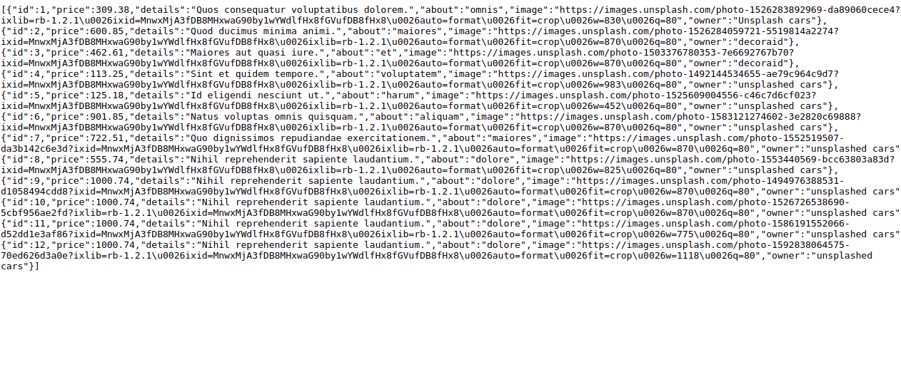

# Find Used Cars

Backend repository that servers API for the Find used car App. You can find the frontend repo by visiting this link https://findusedcar.netlify.com


<p align='center'><small>Database output</small></p>

## Built With

- Rails 6.0.4
- Ruby 2.7.1
- RSpec
- Capybara
- Rack CORS
- ShouldaMatchers
- Active Model Serializer


## Live Demo

The app is published on (https://find-design-api.herokuapp.com/)

## Getting Started

To get a local copy up and running follow these simple example steps.

### Prerequisites

You should have [Ruby 2.7.1](https://www.ruby-lang.org/en/documentation/installation/) installed on your machine along with [Rails 6.0.4](http://railsinstaller.org/en) and [PostgreSQL](https://www.postgresql.org/download/).

**Note:** 

- You need to create a user(role) after you install PostgreSQL in order to user it on your local machine.

### Setup

Open your terminal, type `git clone git@github.com:Kingobaino1/find-house-api.git` and hit Enter to download this repository.

Instal gems with:

```
bundle install
```

Setup database with:

```
   rails db:create
   rails db:migrate
   rails db:seed
```


### Usage

- Start server by typing `rails server` on your terminal in the root directory of the project


### Run tests
> To run test, simply type `rspec` on your terminal.

## Author 

👤 **Kingsley Ibeh**

- Github: [@githubhandle](https://github.com/Kingobaino1)
- Twitter: [@twitterhandle](https://twitter.com/ibehkingso)
- Linkedin: [linkedin](https://www.linkedin.com/in/kingsley-ibeh)

## 🤝 Contributing

Contributions, issues and feature requests are welcome!

Feel free to check the [issues page](https://github.com/Kingobaino1/find-house-api/issues).

## Show your support

Give a ⭐️ if you like this project!

## Acknowledgments

- [ Alexey Savitskiy on Behance](<https://www.behance.net/alexey_savitskiy>).
- [Unplash](https://unsplash.com/)

## License

This project is [MIT](./LICENSE) licensed.
